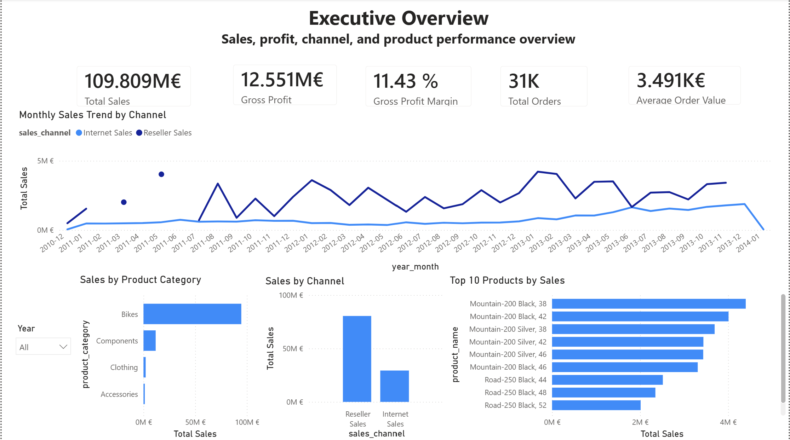
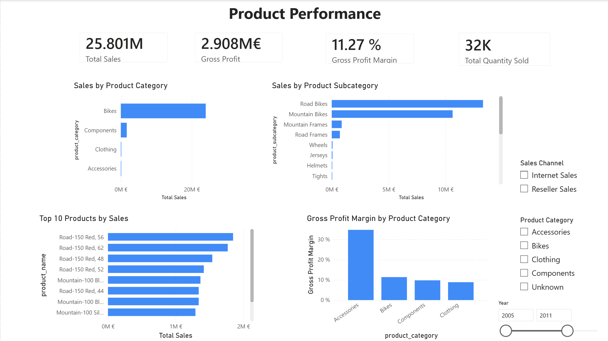
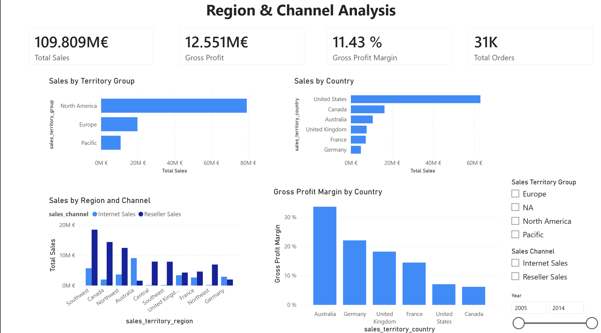

# AdventureWorks Sales Analytics Dashboard

## Overview

This is a business analytics portfolio project using the AdventureWorksDW2022 data warehouse.

The project demonstrates a full workflow from SQL data exploration and reporting-view preparation to Power BI dashboard development. The current version includes three SQL scripts and an initial Power BI dashboard.

## Business Questions

This project analyzes:

* Overall sales, cost, profit, and order performance
* Internet Sales vs Reseller Sales
* Monthly sales trends by channel
* Product category and product-level performance
* Sales territory and regional performance

## Dataset

The project uses the Microsoft AdventureWorksDW2022 sample data warehouse.

The raw `.bak` database file is not included in this repository and should be downloaded separately from Microsoft’s official AdventureWorks sample database resources.

Main tables used include:

* `FactInternetSales`
* `FactResellerSales`
* `DimDate`
* `DimProduct`
* `DimCustomer`
* `DimGeography`
* `DimSalesTerritory`

## Tools

* SQL Server
* SQL Server Management Studio
* Power BI Desktop
* DAX
* Git
* GitHub

## Repository Structure

```text
adventureworks-sales-dashboard/
│
├── sql/
│   ├── 01_data_exploration.sql
│   ├── 02_create_clean_views.sql
│   └── 03_business_kpis.sql
│
├── powerBI/
│   └── AdventureWorks_Sales_Dashboard.pbix
│
├── README.md
└── .gitignore
```

## SQL Workflow

### `01_data_exploration.sql`

Explores the database structure, key tables, row counts, sales date coverage, missing values, product hierarchy, and geography data.

### `02_create_clean_views.sql`

Creates cleaned SQL views for reporting:

* `vw_dim_date`
* `vw_dim_product`
* `vw_dim_customer`
* `vw_dim_sales_territory`
* `vw_fact_sales`

The main output is `vw_fact_sales`, which combines Internet Sales and Reseller Sales into one unified sales fact view with a `sales_channel` field and calculated gross profit.

### `03_business_kpis.sql`

Calculates business KPIs including:

* Total Sales
* Total Cost
* Gross Profit
* Gross Profit Margin
* Total Orders
* Average Order Value
* Year-over-Year Sales Growth
* Sales Contribution Rate

It also analyzes performance by sales channel, product category, territory, and customer segment.

## Power BI Dashboard

The initial Power BI dashboard has been created using the cleaned SQL views.

Current report pages:

1. **Executive Overview**

   * KPI cards for sales, profit, margin, orders, and average order value
   * Monthly sales trend by channel
   * Sales by channel
   * Product category and top product overview

2. **Product Performance**

   * Sales by product category
   * Sales by product subcategory
   * Top products by sales
   * Gross profit margin by product category

3. **Region & Channel Analysis**

   * Sales by territory group
   * Sales by country
   * Channel performance by region
   * Gross profit margin by country

## Dashboard Screenshots

### Executive Overview



### Product Performance



### Region & Channel Analysis



## DAX Measures

Core DAX measures created include:

* Total Sales
* Total Cost
* Gross Profit
* Gross Profit Margin
* Total Quantity Sold
* Total Order Lines
* Total Orders
* Average Order Value

## Current Status

Completed:

* SQL data exploration
* Cleaned SQL reporting views
* SQL-based business KPI analysis
* Power BI data model
* Core DAX measures
* Initial Power BI dashboard
* GitHub repository setup
* Refine dashboard layout and formatting
* Export dashboard screenshots
* Add screenshots to the README


Next steps:

* Write final business insights summary

## Skills Demonstrated

* SQL data exploration
* Data cleaning and transformation
* SQL joins and view creation
* Fact and dimension table modeling
* Business KPI analysis
* Power BI data modeling
* DAX measure creation
* Sales, product, channel, and territory analysis
* GitHub project documentation
